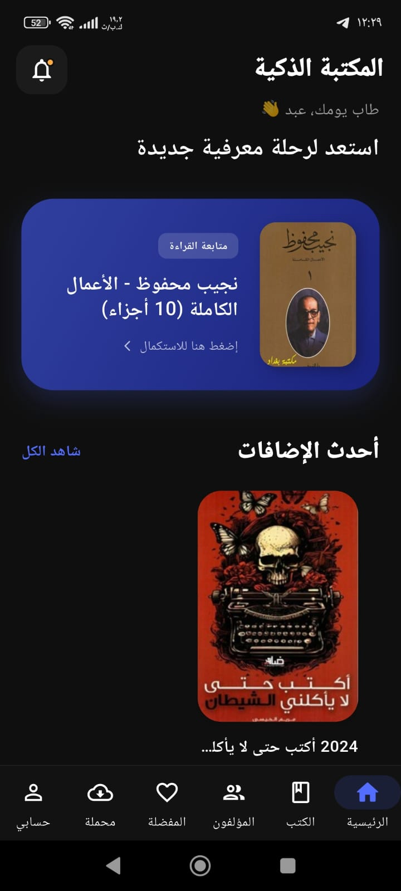
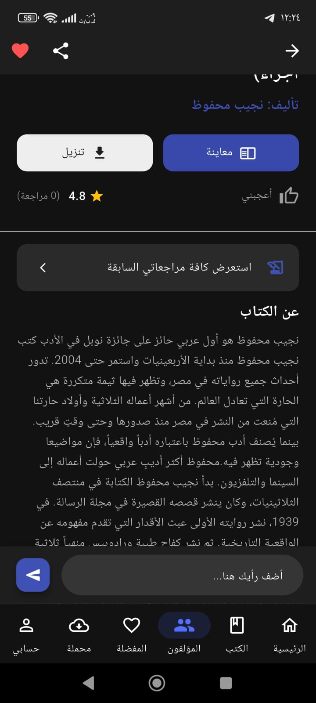
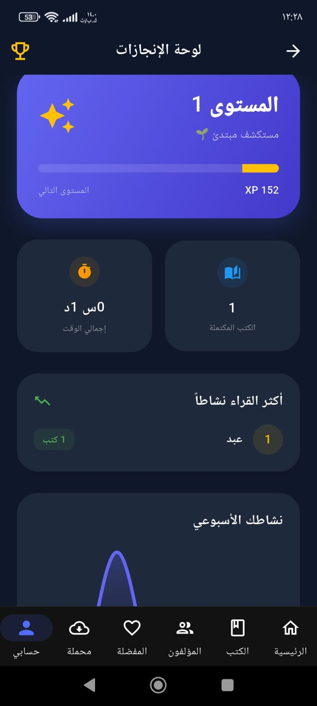
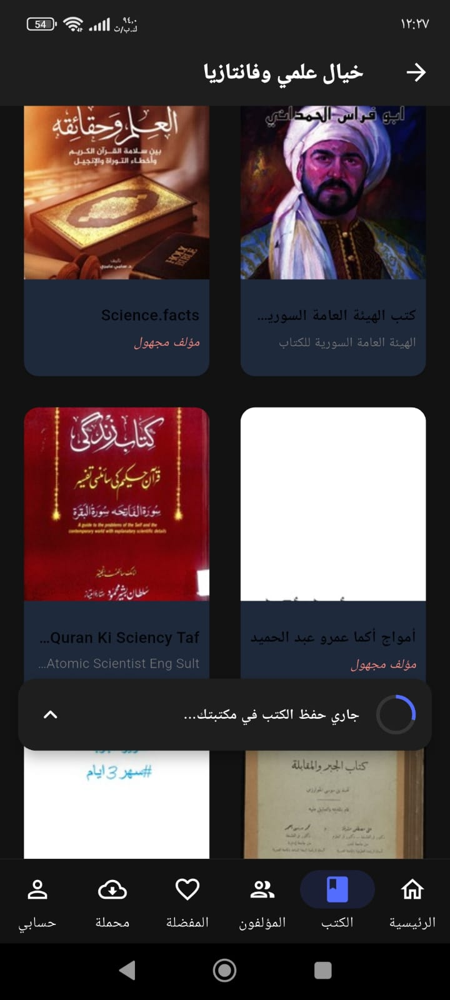
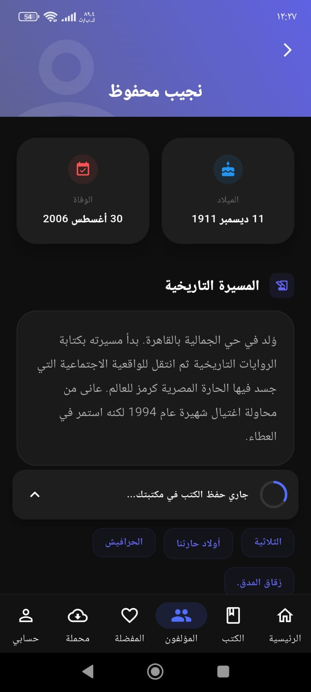
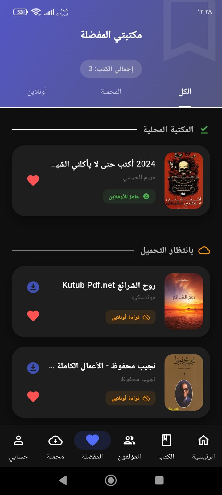

# 📚 Books App - AI Integrated Library

  

  <strong>The Ultimate AI-Powered Reading Companion</strong> 
  Developed with Flutter, BLoC Architecture, and Google Gemini AI.

---

## 🌟 Overview
**Books App** is a high-performance mobile application designed for book enthusiasts. It goes beyond traditional reading by integrating **Google Gemini AI** to provide instant summaries, deep insights into authors, and personalized recommendations. The project follows industry-standard software engineering principles to ensure scalability and security.

## 🚀 Key Features
* **🤖 AI Book Assistant:** Chat with Gemini AI to get summaries, analyze themes, or ask specific questions about any book in the library.
* **🏗️ BLoC State Management:** Robust and predictable state handling using the **BLoC (Business Logic Component)** pattern for a seamless user experience.
* **💳 Sanad Pay Integration:** Ready-to-use secure payment module for premium book access and subscriptions.
* **🌗 Adaptive UI:** Elegant and responsive design supporting both light and dark modes with a focus on typography and readability.
* **🔥 Firebase Backend:** Secure user authentication and real-time data syncing using Cloud Firestore.

## 📱 App Screenshots

  
  
  

  
  
  

## 🛠 Tech Stack & Tools
* **Frontend:** [Flutter](https://flutter.dev) & [Dart](https://dart.dev)
* **Architecture:** Clean Architecture with BLoC Pattern
* **AI Engine:** Google Gemini API (via `google_generative_ai`)
* **Backend:** Firebase (Auth, Firestore, Storage)
* **Design:** Figma (UI/UX)

## 📁 Project Structure
The project follows a feature-driven folder structure for better maintainability:
- `lib/models`: Data structures and JSON serialization.
- `lib/view_models`: BLoC and Cubit logic (e.g., `AiProvider`, `BookProvider`).
- `lib/views`: UI screens and responsive layouts.
- `lib/services`: API calls and external service integrations.

## 👨‍💻 Author
**Abdulrahman Raed Alian**
*Computer Systems Engineer | Software Developer*
[Gaza, Palestine]

---

  Made with ❤️ using Flutter

